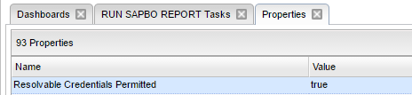
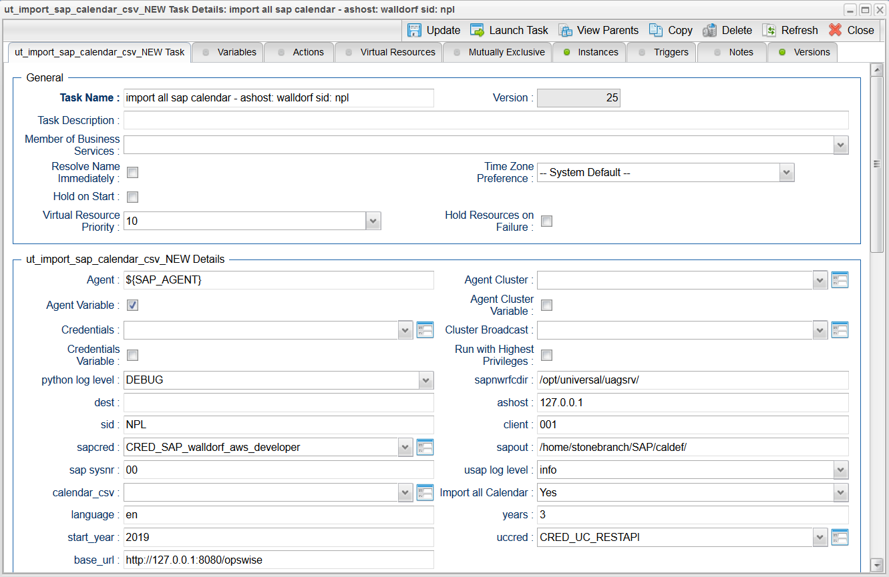
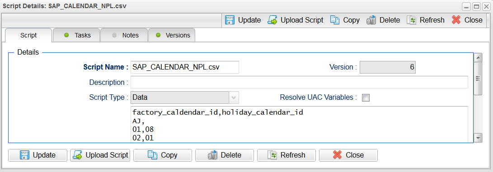
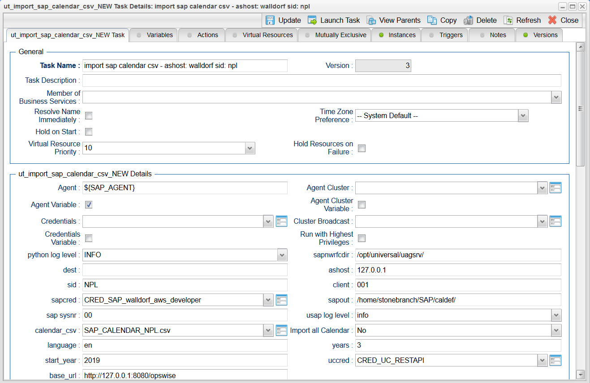
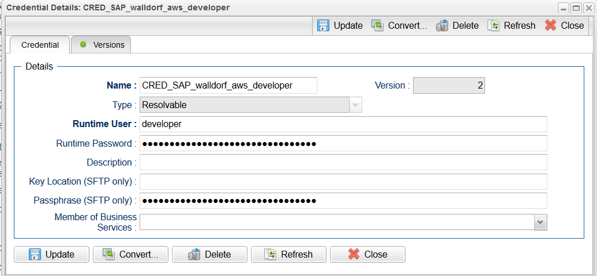
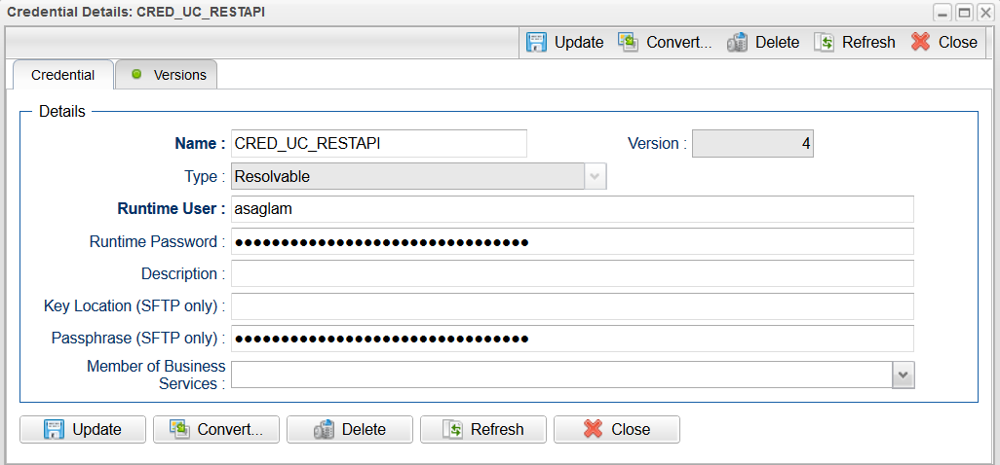
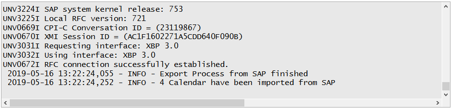

# ut-ms-reportingservices
This Universal Task is based on the SQL Server Reporting Services RS.EXE utility. The here described Universal Task calls a script to 
deploy a report on the Reporting Services Webserver.

# Abstract:
This Universal Task allows to execute an MS SSIS Package using the “dtexec” utility which comes with the Microsoft SQLSERVER installation

# 1	Disclaimer
No support and no warranty are provided by Stonebranch GmbH for this document and the related Universal Task. The use of this document 
and the related Universal Task is on your own risk.

Before using this task in a production system, please perform extensive testing.

Stonebranch GmbH assumes no liability for damage caused by the performance of the Universal Tasks

# 2	Scope 
This document provides a documentation how to install and use the Universal Tasks for SAP Calendar Import. 

# 3	Introduction
This Universal Task is based on the SQL Server Reporting Services RS.EXE utility. RS.EXE is a command line utility that can perform many 
scripted operations related to SQL Server Reporting Services (SSRS). It can be used to complete various administrative tasks including 
publishing reports and moving reports from one server to another server. The RS.exe utility requires an input file to tell the RS.EXE 
"what to do". The list of actual tasks that can be performed is includes among others:

1.	Deploying / Publishing reports
2.	Moving reports
3.	Exporting reports to a file
4.	Adjust security
5.	Cancel a running job
6.	Configure SSRS system properties

The here described Universal Task calls a script to deploy a report (N#1 in the list above).  Points 2-6 in the list above can also be implemented via a script called by the Universal task.

Note: Further details on the RS.exe utility can be found in the attached document [1].  

# 4	System Set-up  
**Universal Task name:** Run SAP Data Service Job
**Related UAC XML Files for template and task: [2]**

**Software used:** 
- MS SQLSERVER 2016 
-	Report Builder in SQL Server 2016
-	Windows Server 2012R2
-	UAC 6.4 Build 40 (beta-release)
-	UA 6.3.0.1 installed on the SAP Data Services Server

# 5	Proposed enhancements

**A)	A script for all possible RS.EXE scenarios should be generated:**

1.	Deploying / Publishing reports (done)
2.	Moving reports
3.	Exporting reports to a file
4.	Adjust security
5.	Cancel a running job
6.	Configure SSRS system properties

**B)	Deploy reports using a SOAP Webservice**

In the attached document [1] the command to deploy a report via a SOAP webservice is described. This solution has the advantage that no 
Universal Agent would have to be deployed on the SQLSERVER.

# 6	Solution Description

The following describes how the Universal Task can be demonstrated, once it is set-up on the Stonebranch demo system.
 
**1.	Configure a new Report using Report Builder in SQL Server 2016**

Image 1:

The report configuration is written to the file system as *rdl file e.g.: rechnunsdaten.rdl

Image 2:

**2.	Test the Report in Report Builder in SQL Server 2016**

Image 3:

Once it is tested in Report Builder in SQL Server 2016, you can deploy the report to the Reporting Server using Universal Task.

**3.	Configure the universal task deploy a Reporting to the Reporting Server**

Universal Task template

Image 4:

Reporting Service Script to deploy a report:

Image 5:

Universal Template fields:

Image 6:

Universal Task

Image 7:

**Dscription:**
- REPORTNAME for the actual name of the report (=report file) to be deployed 
- REPORTSERVER_FOLDER which describes the folder where the file should be deployed to (reportingserver webfolder)
- FILEPATH denotes the location of the rdl file.

**4.	Verify job execution in SAP Data Service Management Console**

Log-On to the Reporting Webserver and check that the report has been deployed (see Universal Task Parameter reportserver): WALLDORF.

e.g. http://walldorf/Reports/browse/ (user:admin/Porsche944)

Browse to the folder, where the report should be deployed (see Universal Task Parameter: REPORTSERVER_FOLDER): /myreports

Image 8:

# 7	Document References
This document references the following documents:

Image 9:

