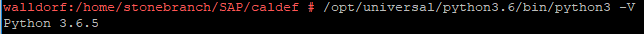
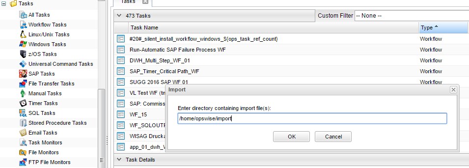

# ut-sap-import-calendar-csv

# Abstract:
This Universal Task allows to mass import SAP calendar into Universal Automation Center. The SAP calendar to import are first extracted 
from SAP using an SAP Function module and then loaded to the Universal Controller via the Rest API. After the import the SAP calendar 
are available as Universal Automation Center Calendar with custom days for holidays and business days.

# 1	Disclaimer
No support and no warranty are provided by Stonebranch GmbH for this document and the related Universal Task. The use of this document 
and the related Universal Task is on your own risk.

Before using this task in a production system, please perform extensive testing.

Stonebranch GmbH assumes no liability for damage caused by the performance of the Universal Tasks

# 2	Introduction
This Universal Task allows to mass import SAP factory and related holiday calendar into Universal Automation Center. The SAP calendar to 
import are first extracted from SAP using an SAP Function module and then loaded to the Universal Controller via the Rest API. After the 
import the SAP calendar are available as Universal Automation Center Calendar with custom days of type holidays and business days.
Some details about the Universal Task to import SAP calendar:

- The Universal Tasks allows to import all SAP factory and holiday Calendar related to a given SID and Client. Optionally only a 
selected list of calendar ids can be imported. The list can be provided by a csv file uploaded to the script library.
- The import can be scheduled via a Time Trigger e.g. import every day the sap calendar.
- It can be configured which calendar years are imported e.g. current year + 2 additional years 
- The Universal Task is based on a Python script template, 
- No python needs to be installed; in case the Universal Agent has been installed with python binding option (parameter –python yes)
- The Universal Task extracts the SAP calendar via the SAP certified UASP connector calling the “calendars” function. 
- The Universal Task imports the extracted SAP Calendar by calling the Universal Controller Rest API. 
- The Universal Task supports both Universal Agent for Linux/Unix and Windows
- You can select different log-levels e.g. Info and debug
- All Passwords are encrypted using Controller Credentials

# 3 Installation
# 3.1 Requirements for Linux/Window Agent
**Universal Template name:** ut-import-sap-calendar-csv
**Related UAC XML Files for template and task: [1]:** 

Requirements to remotely connect from a Windows or Linux agent to an SAP System to extract the SAP factory and related holiday calendar: 

- Universal Agent 6.5.x or higher
- Universal Agent SAP Connector license added to the Universal Agent
- Universal Agent installed with Python Option enabled
- Universal Controller 6.5. or higher
- For Python the following modules are required: 

      - logging, for python loglevel support
      - sys
      - csv
      - time
      - datetime
      - os, for linux command execution
      - shutil
      - subprocess
      - io
      - unicodedata
      - json
      - requests, to call Universal Controller REST API
      
**Note:** Only the module requests need to be added via python installer pip. All other modules are available when installing the agent 
with the python option.

# 3.1 Installation Steps
The following describe the installation steps:

**1.	Check the current Python binding Version of the Universal Agent**
/opt/universal/python3.6/bin/python3 -V (note Captial “V”)

Example:

Image 1:

If your Version is Python 3.6.x or later all is fine. If no python or a lower Version has been installed update your agent with the 
Universal Agent Python binding option (--python yes). This option will install python 3.6. along with your universal agent.

e.g.

sudo sh ./unvinst --network_provider oms --oms_servers 7878@192.168.88.12 --oms_port 7878 --oms_autostart no --ac_netname OPSAUTOCONF --
opscli yes **--python yes**

**2.	Add the required python modules**
The Universal Task requires the module requests. This can be added via Python Package Installer pip.

**Windows Agent:**
C:"\Program Files\Universal\Python36\python.exe" -m pip install requests

**Linux Agent:**
sudo /opt/universal/python3.6/bin/python3 -m pip install requests

**Note: pip requires access to the Internet. If that is not available Stonebranch can provide the module as pre-configured python site-
packages.**

**3.	Import the Universal Task including the Universal Template to your Controller**
Go to “All Tasks” and load via the Import functionality the Universal Task configuration into the Controller. 

Image 2:

